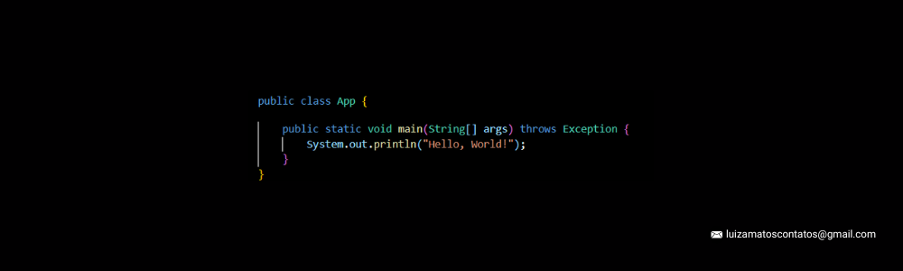

<p align="center">
  
</p>

# GitHub - Luiza Matos 👩‍💻
Seja bem-vindo(a) ao meu GitHub! Aqui você encontra minha trajetória, experiências e projetos desenvolvidos ao longo do caminho. 🚀

---
## 👤 Sobre Mim
- 🎓 Graduanda em **Análise e Desenvolvimento de Sistemas** pela [Newton Paiva](https://www.newtonpaiva.br/).
- 🗣️ Idiomas: **Português (nativo)** | **Inglês (técnico)**.
- ⚽ Hobbies: Futebol, quebra-cabeças e passeios.
- 💼 Objetivo profissional: Atuar com **Desenvolvimento de Sistemas** ou **Análise de Dados**.
- 📚 Atualmente estudando: **Java, JavaScript, HTML, CSS, SQL, Python e Power BI**.

---
## 🚀 Ferramentas & Tecnologias  


---
## Contato
- 🔗LinkedIn: www.linkedin.com/in/luizamatos/
- 📩Email: luizamatoscontatos@gmail.com
- 🛜Site: https://lubmatos.github.io/Site/

---


```bash
// Projeto: Fechamento automático de janela com sensor de chuva
// Hardware: Arduino Nano + Relé 5V + Transistor + Sensor YL-38/39 + Fim de curso

int sensorChuva = A0;     // Entrada analógica do sensor de chuva
int rele = 2;             // Pino que aciona o transistor e o relé
int fimCurso = 3;         // Sensor de fim de curso

int limiteChuva = 400;    // Threshold para detectar chuva

void setup() {
  pinMode(rele, OUTPUT);
  pinMode(fimCurso, INPUT_PULLUP);
  digitalWrite(rele, LOW);

  Serial.begin(9600);
}

void loop() {

  int valorChuva = analogRead(sensorChuva);
  int estadoFimCurso = digitalRead(fimCurso);

  Serial.print("Sensor = ");
  Serial.println(valorChuva);

  // Se detectar chuva e a janela ainda não estiver totalmente fechada
  if (valorChuva < limiteChuva && estadoFimCurso == HIGH) {
    digitalWrite(rele, HIGH);   // Aciona o motor
  } 
  else {
    digitalWrite(rele, LOW);    // Desliga o motor
  }

  delay(200);
}
```

